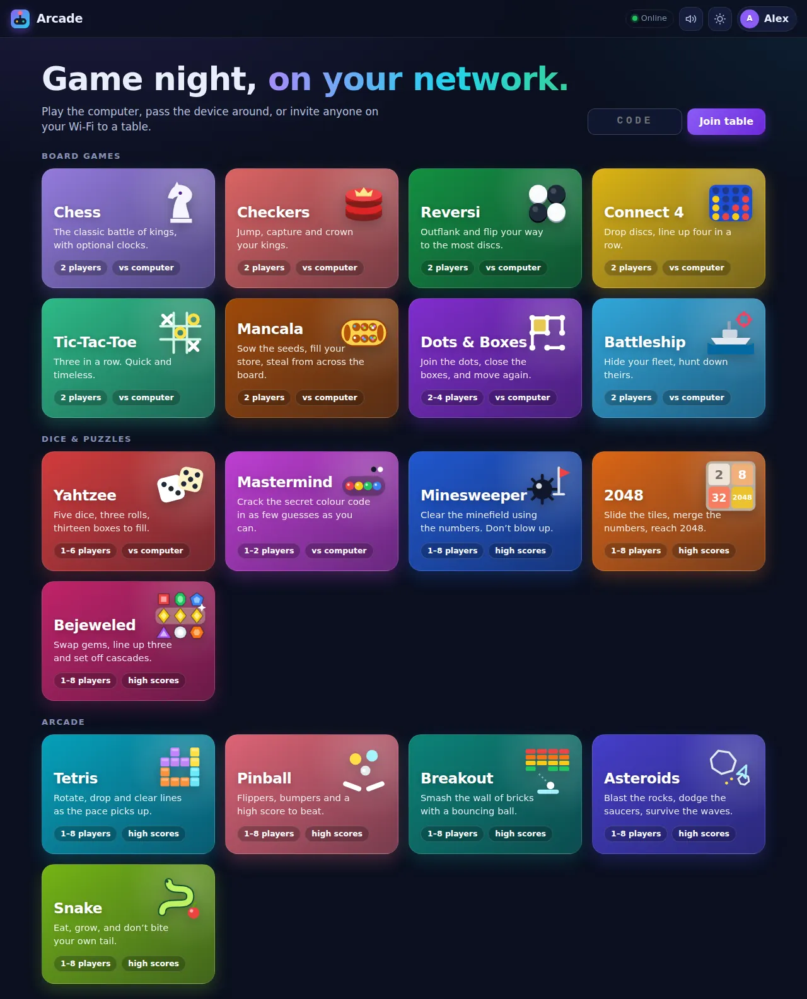
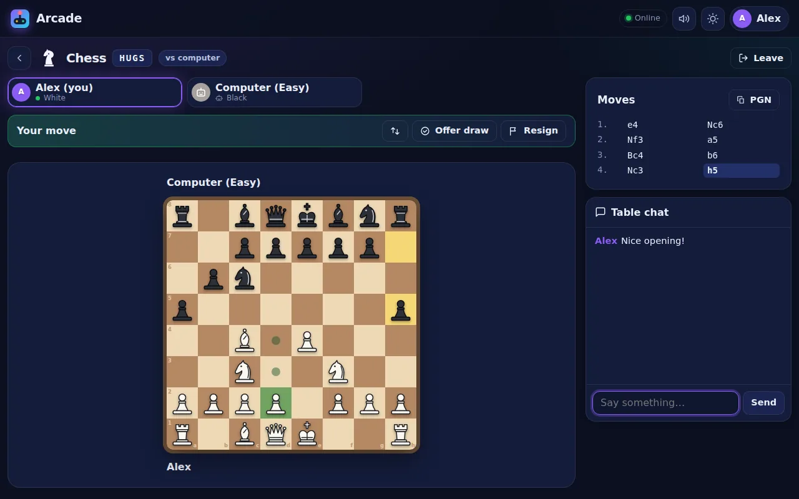
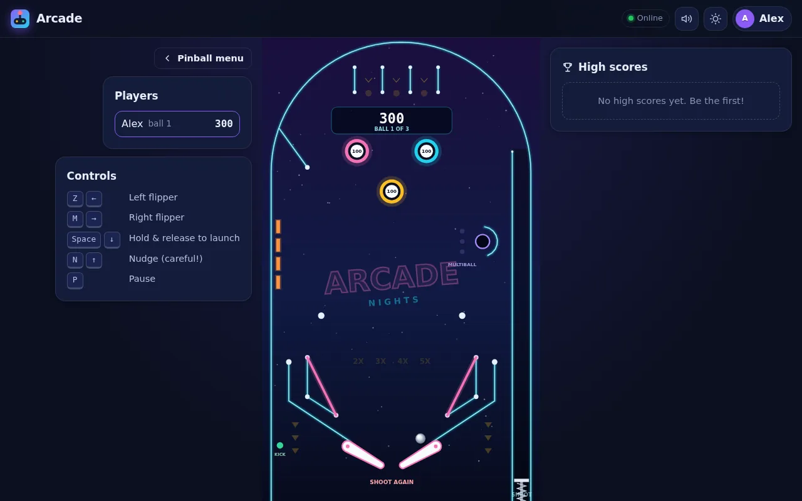
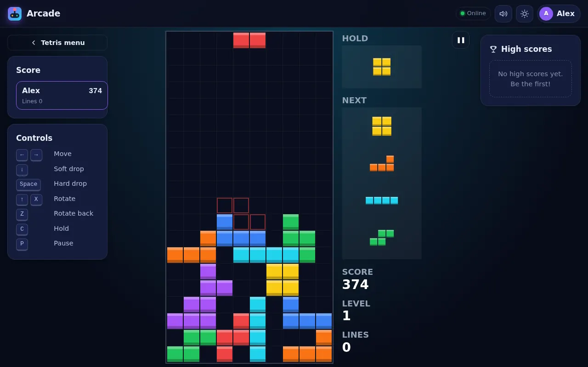
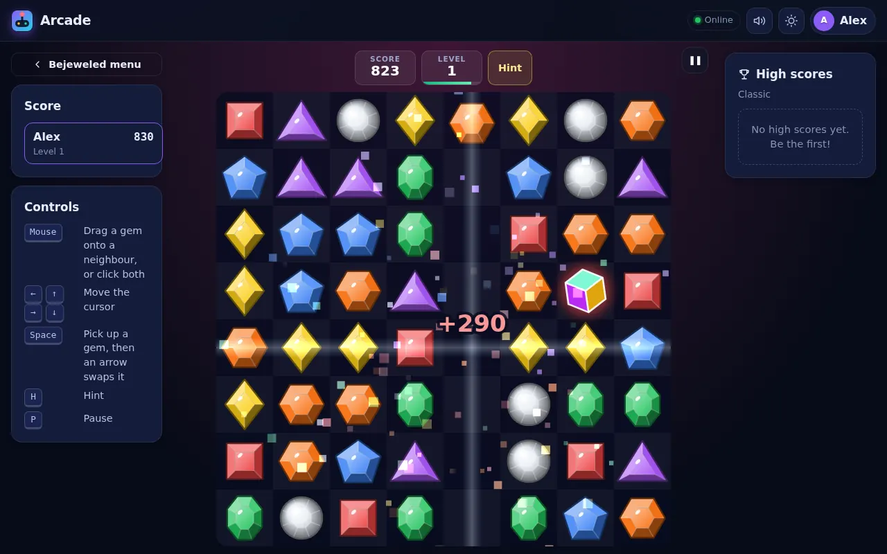
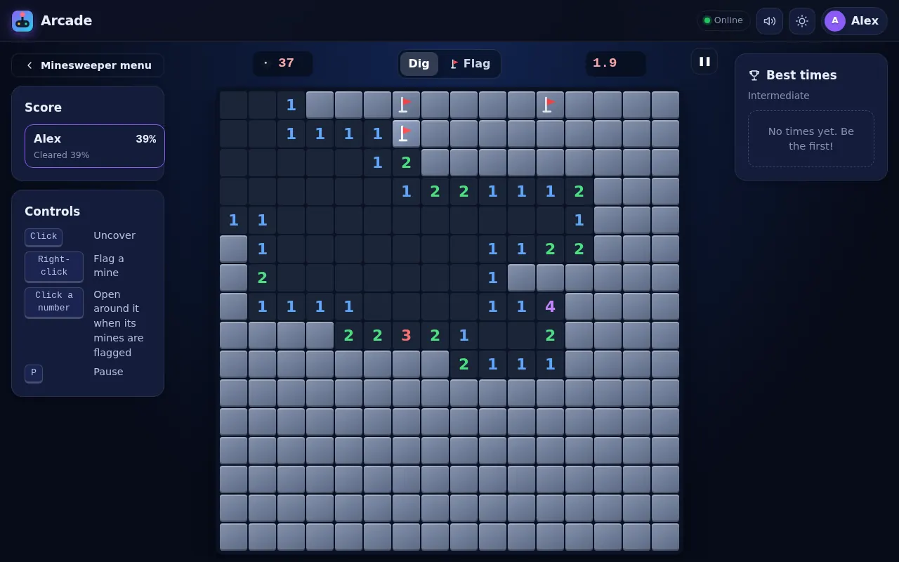
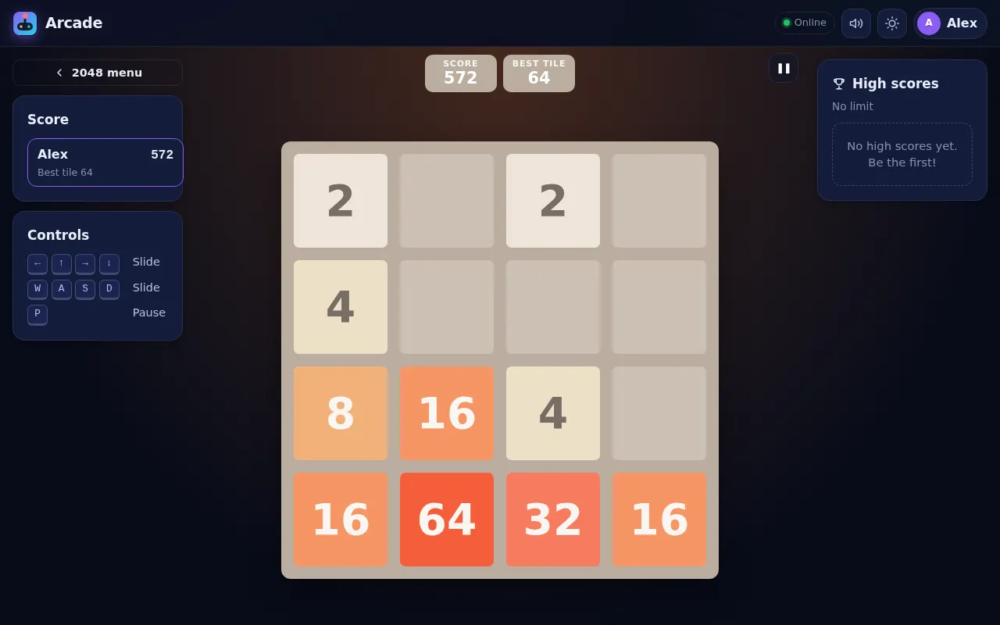
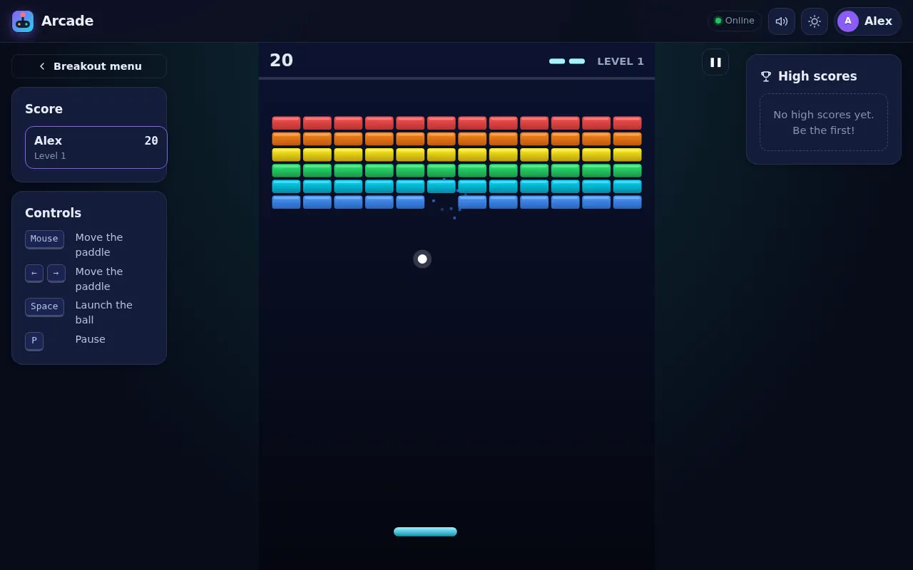
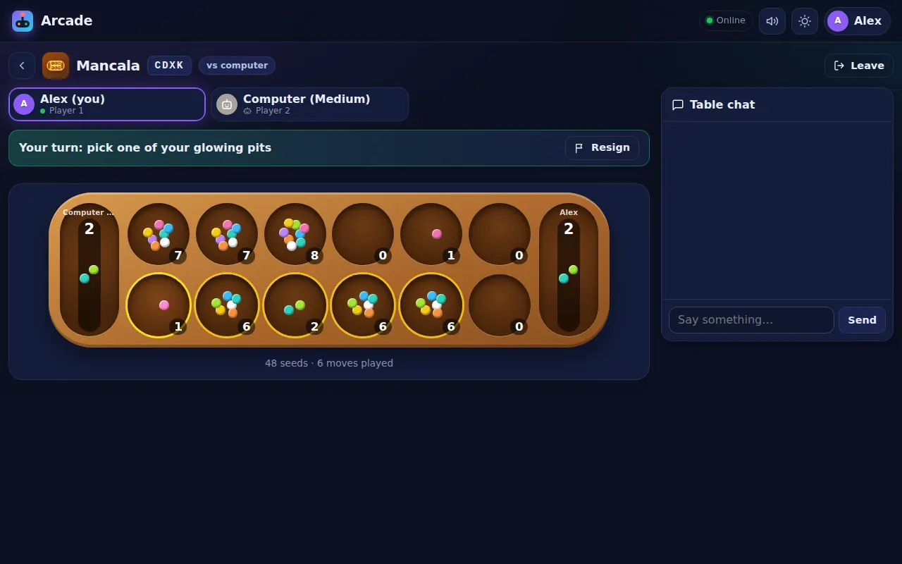

# Games

This repository holds **Arcade**, eighteen browser games for your local network that run in your k3s cluster. Play against the computer, pass one device around, or invite anyone on your Wi-Fi to a table with a link, a QR code or a four-letter code.

It also still contains the original C++ `BattleShip/` prototype, which is untouched.



### Board games

| Game | Players | vs computer | Highlights |
| --- | --- | --- | --- |
| **Chess** | 2 | Easy / Medium / Hard | Full rules, draw offers, optional clocks (3+2 up to 30 min), PGN export. Engine uses alpha-beta search with a small opening book. |
| **Checkers** | 2 | Easy / Medium / Hard | American rules: forced captures (can be turned off), multi-jumps, kings, 40-move draw rule. |
| **Reversi** | 2 | Easy / Medium / Hard | Othello rules with automatic passes, move hints and flipping animations. Hard searches deep and plays the last moves perfectly. |
| **Connect 4** | 2 | Easy / Medium / Hard | Falling discs; the hard computer searches deep and is tough to beat. |
| **Tic-Tac-Toe** | 2 | Easy / Medium / Hard | Hard never loses. |
| **Mancala** | 2 | Easy / Medium / Hard | Kalah rules (extra turns, captures) with 3, 4 or 6 seeds per pit and seed-by-seed sowing. Turns sideways on phones. |
| **Dots & Boxes** | 2–4 | Easy / Medium / Hard | 3×3, 4×4 or 6×6 boxes. Hard knows the long-chain rule, declines boxes to keep control and solves the endgame. |
| **Battleship** | 2 | Easy / Medium / Hard | Tap to place ships (or randomize), three firing modes (classic, streak, salvo), probability-map AI, pass-the-device screens. |

### Dice & puzzles

| Game | Players | vs computer | Highlights |
| --- | --- | --- | --- |
| **Yahtzee** | 1–6 | Easy / Medium / Hard | Official scoring with Yahtzee bonuses and Joker rules, solo high scores. Hard averages about 245 points. |
| **Mastermind** | 1–2 | Easy / Medium / Hard | Crack a random code alone, or set codes for each other and race. 4 pegs / 6 colours or 5 pegs / 8 colours. Hard cracks the classic code in about 4.4 guesses. |
| **Minesweeper** | 1–8 | n/a | Beginner, Intermediate and Expert, safe first click, chording, long-press or flag mode on touch screens. Best times per difficulty; online it is a race on the same minefield. |
| **2048** | 1–8 | n/a | Slide and merge the tiles with arrow keys or swipes. Play without a limit or against a 2 or 5 minute clock (each with its own high score table). |
| **Bejeweled** | 1–8 | n/a | Swap gems to line up three or more. Four in a row makes a flame gem, an L or T a star gem and five a hypercube; cascades and levels multiply the points. Classic (until no move is left) or a 1-minute blitz, each with its own high score table. Every colour has its own shape. |

### Arcade

| Game | Players | Highlights |
| --- | --- | --- |
| **Tetris** | 1–8 | Guideline rotation with wall kicks, 7-piece bag, hold, ghost piece, T-spins, combos, back-to-back bonuses. Keyboard, touch gestures or buttons. |
| **Pinball** | 1–8 | Physics table with flippers, bumpers, slingshots, drop targets, multiball, kickback, tilt. |
| **Breakout** | 1–8 | Five brick layouts that loop faster, silver and gold bricks, and power-ups (wide paddle, multiball, slow ball, extra life). Mouse, keys or touch drag. |
| **Asteroids** | 1–8 | Vector graphics, splitting rocks, both kinds of flying saucer, hyperspace, extra ships every 10,000 points. |
| **Snake** | 1–8 | Smooth movement, golden apples, solid or wrap-around walls (each with its own high score table). |

The arcade games, Minesweeper, 2048 and Bejeweled run in your browser. Play them solo, take turns on one device, or start an
online table where everyone plays at the same time with the same pieces, tiles, gems, rocks or minefield while the scores update live.

Every table has chat, spectators and rematches (players swap sides each rematch). The hall of fame keeps high scores
(Yahtzee, 2048, Bejeweled and the arcade games), best times (Minesweeper) and win/loss records between people.

<p>
  
  
</p>
<p>
  
  
</p>
<p>
  
  
</p>
<p>
  
  
</p>

## Deploy to k3s

### 1. Get the image

The GitHub Actions workflow (`.github/workflows/arcade.yml`) runs the tests and publishes
`ghcr.io/joelmiller1/games` for `linux/amd64` and `linux/arm64` on every push to `master`
(tags `latest` and `sha-<commit>`, plus `x.y.z` for `vx.y.z` git tags).

New GitHub packages start out private. Either make it public (GitHub → your profile → **Packages** → **games** →
**Package settings** → **Change visibility**), or give the cluster a pull secret:

```sh
kubectl create namespace games
kubectl -n games create secret docker-registry ghcr \
  --docker-server=ghcr.io --docker-username=joelmiller1 --docker-password=<token with read:packages>
kubectl -n games patch serviceaccount default -p '{"imagePullSecrets":[{"name":"ghcr"}]}'
```

**No registry?** Build on a machine with Docker and import the image straight into k3s:

```sh
docker build -t arcade:local arcade/
docker save arcade:local | sudo k3s ctr images import -     # run on each node (or copy the tar over)
```

Then point `deploy/k8s/kustomization.yaml` at it (`newName: docker.io/library/arcade`, `newTag: local`)
and set `imagePullPolicy: IfNotPresent` in `deploy/k8s/deployment.yaml`.

The image supports 64-bit x86 and ARM (for example a Raspberry Pi 4/5 on a 64-bit OS). Node.js 24 does not ship 32-bit ARM images.

### 2. Apply the manifests

```sh
kubectl apply -k deploy/k8s        # or: sudo k3s kubectl apply -k deploy/k8s
kubectl -n games get pods,svc
```

This creates the `games` namespace, a 256 Mi volume for scores (`local-path`, the k3s default), a single-replica
Deployment with a locked-down security context, a `LoadBalancer` Service and an Ingress.

### 3. Play

* **http://&lt;any-node-ip&gt;:8080**. k3s's built-in ServiceLB exposes the Service on every node, so this works
  from phones and laptops with no DNS setup. With MetalLB you get a dedicated IP instead (`kubectl -n games get svc arcade`).
* **http://games.lan** through Traefik, once `games.lan` resolves to a node (add a record in your router or
  Pi-hole, or edit the host in `deploy/k8s/ingress.yaml`).

Pick a game, choose **Online** and share the link or QR code shown at the table. Anyone on the network can also
open the home page and join from **Open tables**.

### Updating

Push to `master`, wait for the workflow, then:

```sh
kubectl -n games rollout restart deployment/arcade
```

Tables in progress end when the pod restarts (they live in memory); high scores and records are on the volume and survive.

## Configuration

Environment variables (set them in `deploy/k8s/deployment.yaml`):

| Variable | Default | Purpose |
| --- | --- | --- |
| `PORT` | `8080` | HTTP port |
| `BASE_PATH` | `/` | Serve under a sub-path, e.g. `/games/` behind a shared ingress host |
| `DATA_DIR` | `./data` (`/data` in the image) | Where `arcade-data.json` (high scores, records) is written |
| `BOT_THREADS` | CPU count − 1, max 2 | Worker threads for computer players |
| `ROOM_IDLE_MINUTES` | `30` | Close tables nobody has looked at for this long |
| `MAX_ROOMS` | `300` | Upper limit on open tables |
| `LOG_LEVEL` | `info` | `debug`, `info`, `warn`, `error` or `silent` |

Health probes answer at `/healthz` and `/readyz` regardless of `BASE_PATH`.

## Development

Requires Node.js 20.10 or newer. There is no build step: the browser loads the ES modules directly.

```sh
cd arcade
npm install
npm start          # http://localhost:8080  (npm run dev restarts on server changes)
npm test           # rules engines, computer players, pinball physics, server integration
npm run check      # syntax-checks every file, including browser-only modules
```

### How it fits together

```
arcade/
  server/          HTTP + WebSocket server (ws), rooms, lobby, worker-thread pool for computer players, JSON store
  shared/games/    one rules engine per game: pure functions over JSON state (setup/act/view/outcome/bot)
                   arcade.js is the shared "score attack" engine for the games that run in the browser
  shared/chess/    move generator (perft-verified) and alpha-beta search
  public/          single-page app: lobby, setup and room views, one board module per game
  public/js/pinball/  pinball physics, table, rules and canvas renderer (runs in the browser)
  public/js/arcade/   the browser games (Tetris, Breakout, Asteroids, Snake, Minesweeper, 2048,
                      Bejeweled): rules (tested in Node) and screens
deploy/k8s/        kustomize manifests for k3s
```

The server is authoritative: clients send actions, the engine validates them, and every seat gets its own
view of the state (so Battleship fleets never reach the other player's browser). Computer players are just seats
whose moves come from the engine's `bot()` function, run in worker threads so a chess search never stalls
other tables. The arcade games, Minesweeper, 2048 and Bejeweled are the exception: they run in each browser, and the server hands out
a shared random seed and keeps the scores.

To add a turn-based game: add its metadata to `shared/games/meta.js`, write an engine in `shared/games/` and register
it in `shared/games/index.js`, then add a board module in `public/js/games/` and list it in `public/js/views/room.js`.
For a browser game, mark it `realtime` in `meta.js`, register a `scoreAttack()` engine from `shared/games/arcade.js`,
add a module to `public/js/arcade/` that exports `info` and `create()` (see `snake.js` for a small example), and
list it in `GAME_MODULES` in `public/js/views/arcade.js` and in `public/js/views/room.js` (pointing at `games/arcade.js`).

## Notes

* There are no accounts: each browser gets a random identity and a name you can change from the top bar.
  Refreshing or a phone going to sleep puts you back in your seat.
* The app is plain HTTP for the local network. Everything is served by the arcade itself (no CDNs), so it also
  works on a network without internet access.
